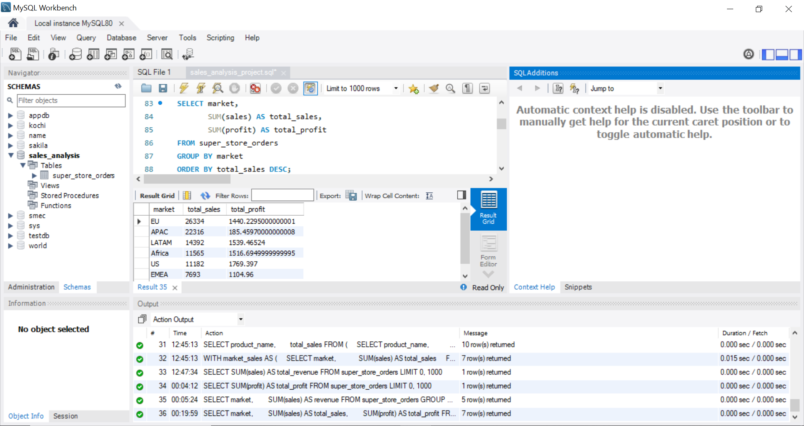
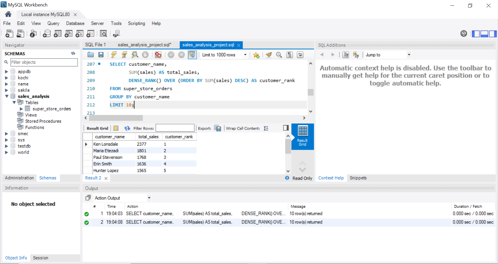
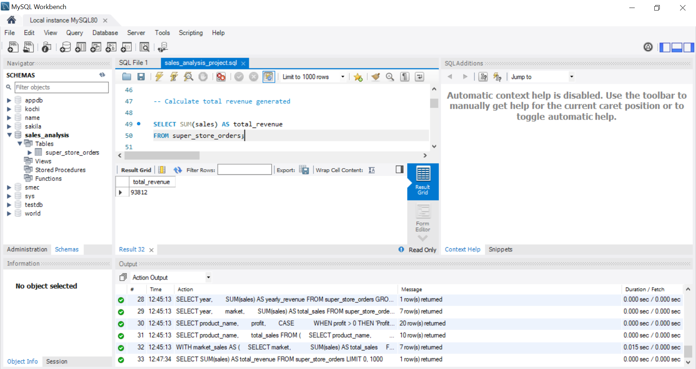

# SQL Sales Analysis Project

## Project Overview
This project analyzes Global Super Store sales data using SQL.

The objective of this project is to perform:
- Sales Analysis
- Profit Analysis
- Customer Analysis
- Product Performance Analysis
- Market & Regional Analysis

## Tools Used
- MySQL Workbench
- SQL

## Dataset
Global Super Store Orders Dataset

## SQL Concepts Used
- GROUP BY
- ORDER BY
- Aggregate Functions
- CASE WHEN
- Window Functions
- CTE (Common Table Expressions)
- Subqueries
- Ranking Functions

## Key Insights
- Identified top-performing markets
- Found highest profit-generating products
- Ranked customers based on sales
- Analyzed regional profitability
- Compared yearly sales trends

## Project Structure

```text
SQL-Sales-Analysis-Project
│
├── screenshots_sql
├── sales_analysis_project.sql
├── Super_Store_Orders.csv
└── README.md
```

## Sample Screenshots

### Market Analysis


### Customer Ranking


### Total Revenue


## Author
Rinoy Jerome